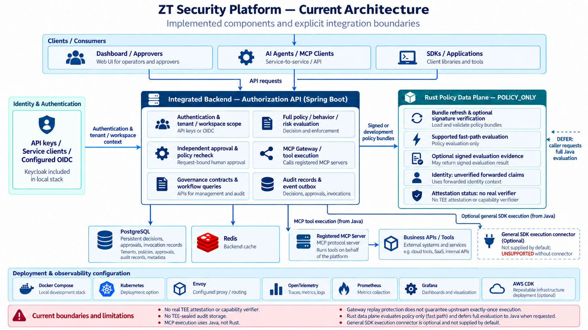
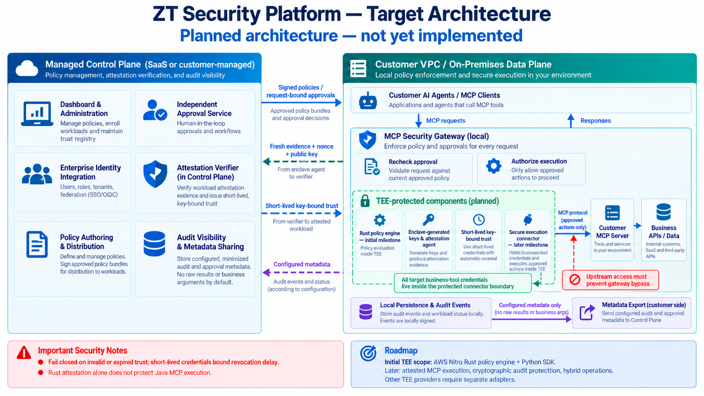

# Zero Trust Security Platform

[English](README.md) · **한국어**

AI 에이전트와 MCP 애플리케이션을 위한 정책 기반 인가 및 도구 실행 통제 플랫폼입니다.

플랫폼은 누가, 어떤 리소스에, 어떤 조건으로 작업을 수행할 수 있는지 평가합니다. 등록된 MCP 도구 호출을 전달하기 전에 독립적인 담당자의 승인을 요구할 수 있으며, 실행 직전에 현재 정책을 다시 확인하고 판단과 실행 기록을 연결해 보관합니다.

**현재 기준:** 4.75.0 Revision 2. 이 저장소에는 개발 중인 구현과 로컬 개발 환경이 포함되어 있습니다. 운영 환경 적합성과 보안 인증은 확립되지 않았습니다. TEE 원격 증명과 SaaS·고객 설치 환경의 분리는 향후 구현할 기능입니다.

## 목차

- [주요 기능](#주요-기능)
- [현재 아키텍처](#현재-아키텍처)
- [빠른 시작](#빠른-시작)
- [환경 설정](#환경-설정)
- [MCP 도구 실행](#mcp-도구-실행)
- [Python SDK](#python-sdk)
- [현재 구현 범위와 한계](#현재-구현-범위와-한계)
- [타겟 아키텍처와 로드맵](#타겟-아키텍처와-로드맵)
- [저장소 구조](#저장소-구조)
- [개발](#개발)
- [관련 문서](#관련-문서)

## 주요 기능

| 영역 | 현재 구현 |
| --- | --- |
| 인가 | 에이전트 실행 범위, 행동 및 위험도 검사를 포함하는 정책 DSL 평가 |
| 신원과 접근 범위 | API 키·서비스 클라이언트 또는 설정된 OIDC 인증, 테넌트·워크스페이스 접근 통제 |
| 담당자 승인 | 승인 대기열, 원래 요청에 연결된 MCP 승인, 승인 후 재개 시 정책 재평가 |
| MCP 실행 | 관리자가 설정한 외부 도구 호출, 인자 제한 및 결과 필터링 |
| 실행 기록 | 판단·승인·계약·MCP 호출 상태·수명주기 이벤트의 영속 저장 |
| 정책 배포 | 버전별 정책 번들, 선택적 Ed25519 서명 및 검증 |
| Rust 평가 | 지원하는 정책의 보수적인 빠른 평가, 번들 최신성 확인, 호출자가 수행하는 전체 평가 전환 |
| 개발자 연동 | Python·TypeScript·Java·Go SDK 소스, 공통 계약 및 예제 |
| 관리 | 정책·승인·에이전트·거버넌스 워크플로를 위한 대시보드 |

## 현재 아키텍처

대시보드와 SDK는 하나의 Spring Boot 백엔드인 `apps/authorization-api`를 사용합니다. Rust 정책 데이터 플레인은 지원하는 정책을 평가하는 별도 서비스입니다.



[현재 아키텍처 그림을 원본 크기로 보기](docs/images/architecture-current.png)

현재 MCP 실행은 Java 평가 파이프라인을 사용하며 Rust의 빠른 평가 경로를 거치지 않습니다. Rust의 `ALLOW`는 정책 평가 결과입니다. 전체 거버넌스 파이프라인이 외부 작업 실행을 승인했다는 증거로 사용할 수 없습니다.

대시보드의 nginx는 `/api/` 요청을 Java API로 전달합니다. PostgreSQL은 애플리케이션과 거버넌스 기록을 저장하고, Redis는 백엔드 캐시를 제공합니다. 로컬 Compose 구성에는 Keycloak, OpenTelemetry Collector, nginx 뒤의 Rust 인스턴스 2개, Envoy 서비스 메시 설정도 포함됩니다.

## 빠른 시작

### 준비 사항

컨테이너로 실행하려면 Docker, Docker Compose 및 Git이 필요합니다. 호스트의 언어별 개발 도구는 해당 구성 요소를 직접 개발할 때 설치하면 됩니다.

### 로컬 환경 실행

```bash
git clone https://github.com/mcp-tee-zt-security/zt-security-platform.git
cd zt-security-platform
docker compose -f docker/docker-compose.yml up -d --build
```

이후 명령은 저장소 루트에서 실행합니다.

| 서비스 | 로컬 주소 | 용도 |
| --- | --- | --- |
| 대시보드 | http://localhost:3000 | 관리 및 워크플로 UI |
| Authorization API | http://localhost:8080 | 전체 평가·거버넌스·MCP API |
| API 문서 | http://localhost:8080/swagger-ui.html | 자동 생성 API 문서 |
| Rust 데이터 플레인 | http://localhost:8091 | nginx를 통한 빠른 정책 평가 |
| Keycloak | http://localhost:8089 | 로컬 신원 제공자 |

기본 Compose 구성은 API 키 `dev-master-key`, 테넌트 `11111111-1111-1111-1111-111111111111`, 워크스페이스 `88888888-8888-8888-8888-888888888801`을 사용합니다. OIDC는 기본적으로 비활성화되어 있습니다. 이 값들은 개발 환경용 설정입니다.

### 상태 확인과 종료

```bash
docker compose -f docker/docker-compose.yml ps
docker compose -f docker/docker-compose.yml logs -f authorization-api
curl http://localhost:8080/v1/health
curl http://localhost:8091/ready
docker compose -f docker/docker-compose.yml down
```

Rust 서비스에 사용 가능한 정책 번들이 없거나 준비 조건을 충족하지 못하면 `/ready`는 사유와 함께 HTTP 503을 반환합니다. `down`으로 종료하면 이름이 지정된 볼륨은 유지됩니다. `-v`를 추가하거나 `make reset`을 실행하면 로컬 데이터베이스·캐시·감사 아카이브 볼륨이 삭제됩니다.

## 환경 설정

[`.env.example`](.env.example)은 기본 설정, 정책 서명, 데이터 플레인 장애 처리 및 증명 상태의 예시를 모은 파일입니다. 재정의할 값이 있으면 `.env`로 복사한 뒤 파일을 명시해 실행합니다.

```bash
docker compose --env-file .env -f docker/docker-compose.yml up -d --build
```

Compose는 각 서비스의 `environment`에 선언된 변수만 전달합니다. API 키와 데이터베이스 설정 등 일부 개발용 값은 Compose 파일에 고정되어 있어 `.env`만 수정해도 바뀌지 않습니다. 현재 증명 설정은 Rust 프로세스에 직접 전달하거나 별도의 Compose 재정의 파일로 전달해야 합니다.

| 설정 | 용도 |
| --- | --- |
| `ZT_API_KEY` | 백엔드 인증 정보. 데이터 플레인의 수신 요청용 키와 구분 |
| `ZT_OIDC_ENABLED`, `ZT_OIDC_ISSUER_URI` | 백엔드 OIDC 인증 |
| `ZT_POLICY_SIGNING_PRIVATE_KEY_B64` | Java 정책 번들 서명 키 |
| `ZT_POLICY_PUBLIC_KEY_B64` | Rust 정책 번들 검증 키 |
| `ZT_REQUIRE_SIGNED_BUNDLE` | Rust에서 서명된 번들만 허용 |
| `ZT_FAIL_MODE` | 기본값 `FAIL_CLOSED`. 가용성 장애 시 제한된 완화 동작을 선택적으로 설정 |
| `ZT_DP_API_KEY` | 설정 시 데이터 플레인 수신 요청 인증 |
| `ZT_MCP_AUDIENCE` | MCP 요청에 필요한 JWT audience |
| `ZT_MCP_ALLOWED_ORIGINS` | 브라우저 MCP 요청의 정확한 Origin 허용 목록 |

개발 환경에서는 정책 서명이 선택 사항입니다. 운영 배포에서는 Java 서명 키와 이에 대응하는 Rust 검증 키를 설정하고 서명된 번들을 필수로 사용해야 합니다. [서명 키 생성기](scripts/linux/generate-policy-signing-key.py)는 Python의 `cryptography` 패키지가 필요합니다.

지원하는 설정과 기본값은 [Rust 설정 문서](apps/policy-data-plane/README.md)와 [MCP 설정 가이드](docs/api/MCP_GATEWAY_EXECUTION.md)를 참고하세요.

## MCP 도구 실행

Gateway는 호출자를 인증하고 인자를 검증한 뒤 전체 Java 정책 파이프라인을 적용해 등록된 도구를 실행합니다.

### 연동 순서

1. 서버에 외부 MCP 엔드포인트와 해당 서버 전용 인증 정보를 설정합니다.
2. **MCP Gateway > Upstream servers**에서 연결을 등록하고 도구 목록을 불러옵니다. **Tool registration**에서 도구를 생성하거나 선택하고 워크스페이스별 실행 바인딩을 저장합니다. 기존 바인딩 API도 사용할 수 있습니다.
3. 허용할 호출자 신원과 인자 제약을 정의하고 필요한 인가 정책을 발행합니다.
4. 인증 정보와 일치하는 테넌트·워크스페이스 헤더로 `POST /v1/mcp/json-rpc`를 호출합니다.

외부 서버와 바인딩은 자동으로 설정되지 않습니다. 대시보드에서 등록한 연결은 테넌트·워크스페이스별로 격리해 PostgreSQL에 저장합니다. 로컬 HTTP는 명시적으로 선택해야 하며, 다른 등록 대상 호스트와 인증 정보의 환경 변수 참조는 배포 설정의 허용 목록이 필요합니다. 주문 서버 예제, MCP 승인 및 호출 이력 사용법은 [대시보드 등록 가이드](docs/api/MCP_DASHBOARD_REGISTRATION.md)를 참고하세요. 배포 설정으로 연결을 관리하려면 [Compose 재정의 예시](docker/docker-compose.mcp.example.yml)도 사용할 수 있습니다.

### 판단과 실행 동작

| 결과 | 동작 |
| --- | --- |
| `DENY` | 외부 도구를 실행하지 않음 |
| `ALLOW` | Gateway 검사를 통과하면 실행. 바인딩에서 승인을 요구하면 승인 대기 |
| `STEP_UP` 또는 승인 필수 | 원래 호출을 저장하고 `PENDING_APPROVAL` 반환 |
| 승인된 호출 | 원래 호출자가 `POST /v1/mcp/calls/{callId}/resume`으로 재개. 서버가 바인딩과 현재 정책을 재확인 |
| 결과 불확정 | `UNKNOWN`으로 보고하며 업무 작업을 자동 재시도하지 않음 |

승인은 원래 호출자·도구·인자에 연결됩니다. 요청자는 자신의 MCP 호출을 승인할 수 없습니다. 새 작업마다 새로운 JSON-RPC ID를 사용해야 합니다. 동일한 범위와 호출자에서 같은 ID를 반복하면 다시 전달하지 않고 기존 호출을 반환합니다. 이 방식은 Gateway의 중복 전달을 막지만 외부 시스템의 정확히 한 번 실행을 보장하지는 않습니다.

외부 서버 어댑터는 Streamable HTTP 도구 호출, JSON 응답, 크기와 시간이 제한되고 종료되는 POST SSE 응답을 지원합니다. 결과는 텍스트 콘텐츠와 객체형 `structuredContent`를 처리합니다. 수신 엔드포인트는 인증된 무상태 JSON-RPC 어댑터입니다. 완전한 MCP OAuth discovery 서버나 모든 MCP 전송 방식·기능을 지원하는 구현은 아닙니다.

인증, 바인딩 예제, 승인 처리, 전송 제약 및 장애 복구 동작은 [MCP Gateway 실행 문서](docs/api/MCP_GATEWAY_EXECUTION.md)를 참고하세요.

## Python SDK

저장소에서 설치합니다.

```bash
python -m pip install ./sdk/python
```

Python 3.10 이상이 필요합니다. 동기식 SDK이며 타입 모델, 구조화된 오류, 접근 범위를 적용한 인증, 거버넌스 워크플로 및 수명주기 이벤트 조회를 지원합니다. SDK 패키지 버전과 서버 기준 버전은 별도로 관리합니다.

```python
import os
from zt_security import ActionContext, ZtSecurityClient

with ZtSecurityClient(
    "http://localhost:8080",
    api_key=os.environ["ZT_API_KEY"],
    tenant_id="11111111-1111-1111-1111-111111111111",
    workspace_id="88888888-8888-8888-8888-888888888801",
) as client:
    request = ActionContext(
        subject="payment-agent",
        action="payment.transfer",
        resource="bank_account/ACC-1001",
        tenant_id=client.tenant_id,
        attributes={
            "amount": 100000,
            "task_id": "payment-demo-task",
            "tool_id": "33333333-3333-3333-3333-333333333301",
        },
    )
    decision = client.evaluate_typed(request)
    print(decision.decision, decision.reason)
```

Python 프로세스의 환경 변수 `ZT_API_KEY`에 서버가 허용하는 인증 정보를 설정하세요. Compose의 `.env` 파일이 별도 Python 프로세스의 환경을 자동으로 설정하지는 않습니다. 예제에는 등록된 신원, 활성 작업·도구 위임, 일치하는 접근 범위와 정책이 필요합니다. 평가만으로 결제를 실행하지는 않습니다.

일반 SDK 거버넌스 수명주기는 증거·승인·실행 계약을 연결해 생성합니다. 외부 실행에는 `GovernedActionExecutor` 커넥터가 필요하며 기본 제공하지 않습니다. 이 경로는 설정된 MCP 외부 서버 실행 경로와 별개입니다.

[Python SDK 가이드](sdk/python/README.md), [공통 계약](sdk/contracts/sdk-api.yaml), [호환성 규칙](sdk/contracts/SDK_CONTRACT.md), [예제](sdk/examples/)를 참고하세요.

## 현재 구현 범위와 한계

| 영역 | 현재 한계 |
| --- | --- |
| TEE 원격 증명 | 실제 검증기와 자동 TEE 배포 미구현. `/v1/attestation/verify`는 HTTP 501 반환 |
| Rust 증명 상태 | 문서 해시는 증명 검증이 아님. 현재 `DISABLED` 이외 모드는 readiness 차단 |
| 워크로드 신원 | 전달된 인증서 헤더를 검증되지 않은 주장으로 표시 |
| 감사 무결성 | 저장된 해시·수명주기 기록·선택적 Rust 증거 서명만으로 TEE 봉인 또는 변조 불가능한 감사 저장소를 구성하지 않음 |
| 일반 SDK 실행 | 외부 커넥터 필요. 커넥터가 없으면 `UNSUPPORTED` 반환 |
| Capability 검증 | 검증기 설치 전 `/v1/capabilities/check`는 HTTP 501 반환 |
| 결과 필터링 | 정확한 문자열 치환과 JSON Pointer 필드 제거. 의미 기반 DLP를 보장하지 않음 |
| 조직 간 신뢰·Kubernetes | 등록 의도만 저장. 검증된 신뢰 수립이나 클러스터 정책 적용은 수행하지 않음 |
| SaaS 배포 | SaaS Control Plane과 고객 설치 Data Plane의 분리 미완료 |

MCP 인자는 승인 후 원래 요청을 재개하기 위해 저장합니다. 전체 평가의 감사 경로에도 컨텍스트가 보관될 수 있습니다. 민감한 업무 데이터를 전달하기 전에 보존 기간과 접근 정책을 정해야 합니다. 외부 서버의 인증 정보는 호출자 인증 정보와 분리되며 Gateway는 호출자의 API 키나 bearer token을 전달하지 않습니다.

## 타겟 아키텍처와 로드맵

목표 배포 구조는 중앙에서 관리하는 **Control Plane**과 **고객 VPC 또는 온프레미스에 설치하는 Data Plane**을 분리합니다. Control Plane은 신원 연동, 정책 배포, 승인 및 감사 조회를 관리합니다. 고객 Data Plane은 업무 시스템 가까이에서 정책을 평가하고 도구 실행을 통제하며, 승인·감사 메타데이터의 공유 범위를 설정할 수 있도록 합니다.

아래는 계획된 구조입니다. 현재 Java 서비스는 관리·전체 평가·MCP 실행을 함께 처리합니다.



[타겟 아키텍처 그림을 원본 크기로 보기](docs/images/architecture-target.png)

| 개선 영역 | 계획 |
| --- | --- |
| TEE 원격 증명 | Nitro부터 지원. 워크로드 등록, 일회용 challenge, 암호학적 검증, Enclave 내부 키 생성, 자동 갱신 및 Python SDK 연동 |
| 컨텍스트 기반 도구 인가 | 세션·도구 통제 확대. 공통 정책 계약을 먼저 정한 뒤 OPA/Cedar 연동 검토 |
| 암호학적 감사 보호 | 전체 이벤트 내용 서명, 키 수명주기 관리 및 외부에서 검증할 수 있는 기록 보관 |
| 하이브리드 배포 | 서명된 정책 배포, 고객 내부 통제, 연결 장애 처리 기준 명확화 |

첫 TEE 단계의 보호 대상은 Rust 정책 엔진입니다. MCP 실행까지 보호하려면 증명된 실행 구성 요소, 보호 경계 내부의 인증 정보, 우회 방지가 필요합니다. Rust만 증명해도 Java Gateway가 보호되는 것은 아닙니다.

## 저장소 구조

| 경로 | 역할 |
| --- | --- |
| `apps/authorization-api/` | Spring Boot 백엔드, 인가·거버넌스·MCP 실행 |
| `apps/policy-data-plane/` | Rust 평가, 정책 번들 검증 및 증거 |
| `dashboard/web/` | 관리 UI와 nginx API 프록시 |
| `sdk/` | 언어별 SDK, 공통 계약, 예제 및 CLI |
| `docker/` | 로컬 Compose 구성과 관련 설정 |
| `infra/` | 인프라 코드와 데이터 플레인 프록시 설정 |
| `k8s/` | 배포 매니페스트와 operator 리소스 |
| `ops/` | 운영 설정과 대시보드 |
| `scripts/` | Windows·Linux 운영, 데이터베이스 및 품질 도구 |
| `benchmarks/` | 성능 측정 파일 |
| `docs/` | 아키텍처·API·보안·개발·운영 문서 |

루트 `pom.xml`은 Java 백엔드의 부모 및 통합 빌드 설정입니다. 루트 `package.json`과 `Makefile`은 개발 명령을 제공합니다. 환경 설정 예시는 `.env.example`에 통합되어 있으며, 과거 빌드 기록은 `docs/history/`에 보관합니다.

## 개발

백엔드는 JDK 17과 Maven 3.9 이상, Python SDK는 Python 3.10 이상을 사용합니다. 나머지 구성 요소는 각 프로젝트가 선언한 개발 도구를 사용하세요. 아래 명령은 개발자를 위한 안내이며 현재 코드가 해당 검사를 통과했다는 증거는 아닙니다.

```bash
# Java 백엔드
mvn -pl apps/authorization-api -am test

# Python SDK
python -m pip install -e "./sdk/python[dev]"
python -m pytest sdk/python/tests

# 대시보드
npm --prefix dashboard/web install
npm run dashboard:build

# Rust 데이터 플레인
cargo test --manifest-path apps/policy-data-plane/Cargo.toml
```

추가 작업 흐름은 [개발자 가이드](docs/development/4.75_DEVELOPER_GUIDE.md)를 참고하세요. 종합 품질 스크립트 `scripts/quality/check.sh`에는 Go 포맷 작업이 포함되어 있어 Go 소스 파일을 수정할 수 있습니다.

개발에서는 안정화, 코드 가독성 및 문서화를 우선합니다. 신규 기능은 명시적으로 범위를 정한 뒤 추가합니다. 이미 적용된 Flyway 마이그레이션은 유지하고 스키마 변경은 새 마이그레이션으로 추가하세요. SDK 계약을 서버 동작과 일치시키고 구현된 기능과 배포 계획을 구분해야 합니다.

## 관련 문서

- [문서 목차](docs/INDEX.md)
- [플랫폼 아키텍처](docs/architecture/4.75_ARCHITECTURE.md)
- [보안 모델](docs/security/4.75_SECURITY_MODEL.md)
- [백엔드 API와 거버넌스](docs/api/4.75_BACKEND_API.md)
- [MCP Gateway 실행](docs/api/MCP_GATEWAY_EXECUTION.md)
- [MCP 대시보드 등록](docs/api/MCP_DASHBOARD_REGISTRATION.md)
- [Rust 데이터 플레인](apps/policy-data-plane/README.md)
- [Python SDK](sdk/python/README.md)
- [운영](docs/operations/4.75_OPERATIONS.md)
- [관측 및 모니터링](docs/operations/4.75_OBSERVABILITY.md)
- [과거 빌드·시작 오류 수정 기록](docs/history/BUILD_FIX_4.75.0.md)

저장소 전체에 적용되는 배포·재배포 라이선스 조건은 아직 명시되어 있지 않습니다. 이 README는 공개 SDK 패키지 배포나 운영 인증을 주장하지 않습니다.
## Stitch AI 접근 통제 PoC

대시보드 **Agents & Connections → Stitch Access PoC**에서 합성 폴더·채널 데이터를 준비하고, 관리자와 인증된 AI 서비스 클라이언트의 문서 조회·검색 결과를 비교할 수 있습니다. 상위 폴더의 AI 접근 금지 설정을 상속하며 검색 응답에서도 금지된 자료를 제외합니다.

로컬 Compose는 `ZT_STITCH_POC_ENABLED=true`를 기본 사용합니다. 운영 배포에서는 비활성화하세요. 실제 Stitch 사용자 ACL·LLM·MCP·벡터 검색·TEE 연동은 포함하지 않습니다. [데모 진행 안내](docs/api/STITCH_ACCESS_POC.ko.md)와 [Postman Collection](docs/postman/Stitch-Access-PoC.postman_collection.json)을 참고하세요.

## Stitch 표준 연동 계약

별도의 **Stitch Integration** 표준 연동 API는 OIDC 사용자·AI 위임, 소스 ACL/그룹 동기화, 파일·첨부파일, PostgreSQL 검색/RAG, 권한 버전 캐시, 보존·삭제 요청/확인 계약을 제공합니다. 실제 Stitch와 외부 저장소에 연결하거나 네트워크 제한을 적용한 상태는 아닙니다. [연동 계약](docs/api/STITCH_INTEGRATION_V1.md)과 [로컬 OIDC 개발 절차](docs/api/STITCH_INTEGRATION_LOCAL.ko.md)를 확인하세요. 기본 설정은 비활성화입니다.

### 가상 Stitch + Stitchy 시뮬레이션

선택적인 로컬 시뮬레이터는 표준 연동 API에 가상 Teams 자료/ACL 서버와 Stitchy MCP 클라이언트를 연결합니다. Alice/Bob/AI의 Payroll 접근 차이, 검색 결과 필터링, 권한 변경, 세션 취소, 임시 자료 삭제와 수신자 ACK를 전용 화면에서 비교합니다. 외부 Stitch나 LLM 연결 없이 허용된 도구 결과를 인용하여 답변합니다.

[실행 및 시연 안내](docs/demo/STITCH_SIMULATION.ko.md)를 따라 `docker/stitch-simulation.compose.yml` overlay를 시작한 뒤 **http://localhost:8766**을 엽니다. 기존 대시보드 **Stitch Integration**에서도 연결할 수 있습니다. Stitchy는 전용 Docker internal network에서 읽기 gateway만 사용하며 직접 원본/DB 자격 증명을 받지 않습니다. 이 구성은 로컬 시뮬레이션이며 실행 검증을 수행한 상태는 아닙니다.
