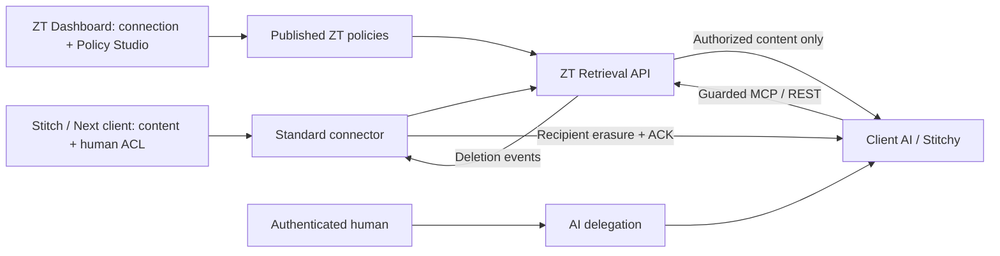

# 클라이언트 시뮬레이션: Stitch × ZT

**AI 정책은 ZT가 관리합니다.** Stitch는 자료와 기존 사용자 ACL을 제공하는 클라이언트입니다. 가상 Stitch/Stitchy를 실제 로컬 ZT API에 연결하며 외부 Stitch 서비스/LLM에 연결하거나 외부 환경에 배포하지 않습니다.

| 주체 | 관리하는 것 |
|---|---|
| 클라이언트(Stitch) | 사용자·그룹·폴더·채널·파일·첨부파일, 사용자 ACL, 변경 feed |
| ZT 관리자 | 워크스페이스·연결 등록, AI 정책 DRAFT/Publish/Deactivate, 감사 이력 |
| 사용자 Alice/Bob | 자신의 인증과 AI 위임 세션 |
| Stitchy | ZT를 통한 조회·검색, 승인된 내용만 인용, 삭제 요청 처리 |

AI 접근은 **사용자 ACL ∩ 현재 사용자 권한 ∩ 위임 세션 ∩ 활성 ZT 정책**입니다. ALLOW가 없으면 차단하며 DENY가 우선합니다. 사람의 조회는 소스 ACL을 사용합니다.

## 1. 서비스 반영

루트에서 실행할 명령입니다. 개발 중 빌드·테스트·실행 검증은 수행하지 않았습니다.

```powershell
docker compose -f docker/docker-compose.yml -f docker/stitch-simulation.compose.yml up -d --build authorization-api dashboard stitch-source stitchy-simulator stitch-sim-gateway stitch-simulator
docker compose -f docker/docker-compose.yml -f docker/stitch-simulation.compose.yml up -d --no-deps --force-recreate stitch-sim-gateway
```

Flyway V8은 연결 메타데이터/정책 감사 컬럼을 추가하며 기존 V7 데이터/DB 볼륨을 지우지 않습니다. 연결과 ALLOW 정책은 자동 생성하지 않습니다. 이전 소스 aiAccess 값은 남아 있어도 판정에 사용하지 않습니다.

두 번째 명령은 공통 Retrieval 경로를 추가한 nginx 설정을 읽도록 gateway만 다시 만듭니다. 인증 서버/DB를 다시 만들지 않습니다.

Keycloak 파일명은 `docker/keycloak/zt-stitch-contract-realm.json`입니다. 이전 잘못된 파일명으로 종료됐다면 수정 후 `docker compose -f docker/docker-compose.yml -f docker/stitch-simulation.compose.yml restart keycloak`을 실행합니다. Bob이 없는 오래된 임시 Keycloak은 `up -d --force-recreate keycloak`로 다시 만들 수 있습니다. 기본 Keycloak 컨테이너의 임시 설정/로그인은 초기화되며 ZT PostgreSQL은 지우지 않습니다.

## 2. ZT에서 연결 등록

1. **http://localhost:8766** → **Show ZT connection details**. 페이지 상단 전용 영역에서 검증된 connectorSubject와 테스트 자격 증명을 확인합니다. Connector JWT/client secret, Alice/Bob JWT, 발급된 Stitchy AI secret을 표시하며 Copy 버튼으로 복사할 수 있습니다. AI secret은 Prepare client data 이후 발급됩니다. 연결 정보를 먼저 열어두면 준비 완료 후 AI 자격 증명도 갱신합니다. 토큰 정보는 버튼을 다시 눌러 불러올 수 있습니다.
2. **http://localhost:3000 → Agents & Connections → Retrieval Access**.
3. 워크스페이스 `88888888-8888-8888-8888-888888888801`을 선택합니다.
4. Connection ID `stitch`, Display name `Stitch local simulator`, Authenticated connector subject에는 앞서 확인한 값을 복사하고 Enabled를 체크하여 **Save connection**.
5. 클라이언트 화면 → **Prepare client data**. 사용자·자료·ACL/source 완료 체크포인트를 동기화합니다. 처음이면 AI 서비스 계정도 등록합니다. **AI 정책은 생성하지 않습니다.**
6. ZT 화면 → **Refresh resources / policies**.

시뮬레이터, Retrieval Access, 클라이언트 콘솔과 호환 API 콘솔은 실행 중/완료/실패 알림을 표시합니다. DENY는 HTTP 실패와 구분하여 요청 완료·접근 차단으로 안내하며, ALLOW + 빈 결과는 반환 0건으로 표시합니다. 서버 변경이 저장된 뒤 화면 갱신이 실패하면 저장 완료와 후속 실패를 구분합니다. 자동 상태 갱신은 마지막 작업 메시지를 지우지 않습니다. Enabled 체크박스는 문구 옆에 배치합니다.

워크스페이스당 한 소스 연결을 사용합니다. 기존 자료를 다른 connector에게 재할당하지 않습니다. 등록되지 않은 connector는 같은 sync 역할을 가져도 동기화할 수 없습니다.

## 3. ZT에서 AI 정책 활성화

**Author AI policies in ZT**에서 아래 정책을 각각 **Validate → Save DRAFT → Publish reviewed DRAFT** 합니다.

| 정책 이름 | Effect | Resource subtree | Optional AI subject |
|---|---|---|---|
| allow_stitch_retrieval | ALLOW | All resources in this connection | 빈 값 또는 client:stitchy-simulator |
| deny_stitch_payroll | DENY | Payroll / sim-stitch-payroll | 빈 값 |
| deny_stitch_finance | DENY | #finance / sim-stitch-finance | 빈 값 |

기존 ZT `policies` 테이블/DSL/evaluator를 사용하므로 Policy Studio에도 표시됩니다. DRAFT 저장만으로 실행에 반영되지 않습니다.

```go
policy "deny_stitch_payroll" {
  priority 10
  effect deny
  principal.type == "AI_AGENT"
  action in ["retrieval.read", "retrieval.search", "retrieval.list", "retrieval.download"]
  resource.type == "retrieval_resource"
  condition {
    context.connectionId == "stitch" and
    resource.ancestors contains "sim-stitch-payroll"
  }
}
```

ancestors는 ZT가 등록된 부모 관계에서 계산하며 자신도 포함합니다. 모델이 요청 JSON으로 권한 경로를 만들어 보내지 않습니다. 하위 파일·첨부파일까지 차단합니다. 차단 해제는 해당 DENY의 **Deactivate**로 수행합니다. 추가 ALLOW로 DENY를 덮을 수 없습니다. 기존 ACTIVE 버전/tenant-wide 정책도 확인합니다.

전체 DSL은 Policy Studio에서도 작성할 수 있습니다. Retrieval Access에서 다른 워크스페이스를 선택했다면 Policy Studio의 기본 워크스페이스와 같다고 가정하지 마세요. 이 실행 경로는 ACTIVE 정책을 사용하고 Canary/risk/TEE/승인 재개는 포함하지 않습니다. STEP_UP도 내용 반환을 차단합니다.

## 4. 호출 비교

클라이언트에서 Alice의 **Create / renew AI session**을 누릅니다. 아래는 위 3개 정책을 Publish한 후의 기대 결과입니다. 정책이 없다면 AI는 모두 기본 차단입니다.

| 호출자 | Projects / #general | Payroll / #finance |
|---|---|---|
| Alice (employees, finance) | 사용자 ACL 허용 | 사용자 ACL 허용 |
| Bob (employees) | 사용자 ACL 허용 | 사용자 ACL 차단 |
| Stitchy (Alice 위임) | 사용자 ACL + ZT ALLOW | ZT DENY |
| Stitchy (Bob 위임) | 사용자 ACL + ZT ALLOW | 사용자 ACL 및 ZT DENY |

- October payroll **Read document**: Alice 허용 / Bob 차단 / Stitchy 차단.
- Payroll supporting document 및 **Download**도 비교합니다.
- Stitchy **Search / RAG**, Project: 허용된 handbook/#general 자료 반환.
- Stitchy 검색 Payroll: 처리된 검색에서 차단 자료가 제외되어 빈 결과.
- Alice 검색 Payroll: 사용자 ACL로 재무 자료 반환.

왼쪽 Workspace는 클라이언트 관리자 관점의 합성 메타데이터이며 AI 검색 결과가 아닙니다. MCP는 공통 `/v1/integrations/retrieval/mcp`, 다운로드는 같은 계약의 REST를 사용합니다. 신원은 전용 서비스 credential, 위임은 X-ZT-Delegation 헤더이며 모델 arguments에는 넣지 않습니다. 답변은 이번 승인 결과만 인용하는 추출형 시뮬레이터입니다. LLM 추론/자동 도구 선택/embedding 생성 성능 시연은 아닙니다.

## 5. 변경·캐시·삭제

1. Stitchy로 Project handbook 읽기 → 임시 저장소에 resource ID 확인.
2. **ZT**에서 Projects subtree DENY를 Publish.
3. 같은 호출 반복 → Projects 문서는 차단. 허용된 #general 메시지는 검색에 남을 수 있습니다.
4. ZT **Actual ZT retrieval audit** → decision, 반환 개수, policy_reason, matched_policies 확인.
5. Connector 다음 주기(20초) 또는 클라이언트 **Process deletion events** → 이전 전달 문서/인용 답변 삭제와 수신자 ACK.
6. ZT에서 DENY를 Deactivate → 나머지 정책으로 새 호출 평가.

Publish/Deactivate/Rollback은 해당 범위의 캐시/disclosure를 같은 트랜잭션에서 보수적으로 무효화하고 삭제 이벤트를 생성합니다. 현재 workspace 단위라 선택 폴더 외 자료도 삭제 대상일 수 있습니다. 클라이언트의 source sync/Reset은 ZT 정책을 덮어쓰지 않습니다.

연결을 Disabled로 저장하면 자료 조회/동기화는 차단합니다. 기존에 등록된 connector/수신자에게는 문서 내용을 반환하지 않는 삭제 이벤트 조회·ACK만 허용하여 기존 전달 내용의 정리를 계속할 수 있습니다.

Alice Finance 그룹 제거/복구는 **클라이언트 화면**에서 진행합니다. AI DENY를 해제해도 사람이 못 보는 Payroll을 그 사람의 AI에게 허용할 수 없습니다. 세션 취소 후 자동 재발급하지 않으며 새 위임은 사람이 생성합니다. Connector 중단/미완료 및 snapshot 120초 만료 때 접근을 차단합니다. 직접 DB/API probe는 격리된 AI 컨테이너에서 고정 DNS/TCP 주소만 관찰합니다.

AI 임시 자료/답변은 60초 보존 후 삭제합니다. ACK는 이 가상 수신자의 메모리/보존 답변에만 적용되며 이미 브라우저에 표시된 텍스트·스크린샷·외부 백업은 회수하지 않습니다. Reset은 합성 자료/그룹만 복원하고 ZT 정책·감사·계정을 초기화하지 않습니다. 임시 portal 볼륨에는 AI secret/cursor가 있으므로 기존 계정을 사용하려면 보존합니다. 볼륨만 지우면 중복 계정 409가 생길 수 있습니다.

## 다음 클라이언트

ZT **Create workspace → 새 connectionId/검증된 connector subject 등록 → 소스 동기화 → AI 정책 Publish → 사용자/AI 세션으로 호출** 순서입니다. IdP claims/credential은 새 tenant/workspace와 일치해야 합니다. 기존 Stitch 토큰의 헤더만 바꾸어 다른 고객 인증으로 사용할 수 없습니다.

Retrieval Access 하단 **Client contract console — any registered source**에서 새 워크스페이스와 클라이언트의 자격 증명을 사용하여 바로 요청할 수 있습니다. `context`로 신원을 확인한 후 `subject/resource` 동기화 → `state/checkpoint` 완료 → 사용자 `delegate` → AI `read/search/mcp` 순서로 진행합니다. 예제 ID/그룹/sourceVersion은 해당 클라이언트의 자료와 맞게 수정합니다. 위에서 정책 관리를 할 때 사용한 관리자 키는 이 호출 콘솔에 전달하지 않습니다.

[클라이언트 공통 계약](../api/RETRIEVAL_CONTROL_PLANE_V2.md)과 [Postman collection](../postman/Retrieval-Control-Plane-v2.postman_collection.json)을 참고하세요. ZT 판정 코드를 변경하지 않고 새 설정/소스 어댑터를 붙입니다. 실제 제공자의 ACL/change feed를 계약으로 변환하는 어댑터는 필요합니다.



내부 DB/일부 클래스는 기존 stitch_ 이름을 유지합니다. 공개 API는 Retrieval이며 기존 Stitch API는 호환 별칭입니다. 고정 Stitch Access PoC는 별도이며 중앙 정책 데모의 실행 경로가 아닙니다.

