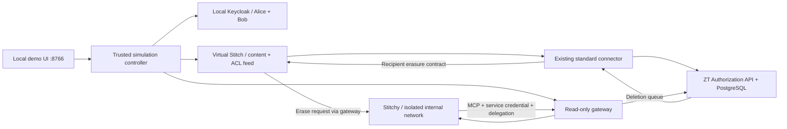

# Stitch × ZT 로컬 시뮬레이션

실제 Stitch 시스템에 연결하거나 외부 환경에 배포하지 않습니다. 가상 Stitch 서버, 가상 Stitchy 클라이언트, 실제 로컬 ZT Authorization API를 조합합니다. 기존의 고정된 PoC 결과와 달리, 표준 연동의 OIDC 인증·ACL·PostgreSQL 검색·MCP·삭제 큐를 사용합니다.

## 실행

저장소 루트에서 실행합니다. 아래는 사용자가 실행할 명령이며 개발 과정에서 빌드·테스트·실행하지 않았습니다.

```powershell
docker compose -f docker/docker-compose.yml -f docker/stitch-simulation.compose.yml up -d --build keycloak authorization-api dashboard stitch-source stitchy-simulator stitch-sim-gateway stitch-simulator
```

브라우저에서 **http://localhost:8766**을 엽니다. ZT 대시보드의 **Agents & Connections → Stitch Integration → Open local simulation**에서도 열 수 있습니다.

1. **Prepare demo**: 가상 Stitchy 전용 서비스 계정을 ZT에 등록하고, 소스 사용자·권한·자료를 Connector로 동기화합니다. Alice/Bob의 Keycloak 인증도 수행합니다. 버튼을 누르기 전에는 ZT 자료/계정을 생성하지 않습니다.
2. AI를 위임하는 사람을 **Alice**로 선택하고 **Create / renew AI session**을 누릅니다.
3. 아래 시나리오를 하나씩 실행합니다. 화면의 결과와 실제 API/MCP 응답을 함께 확인합니다.

Keycloak은 `zt-stitch-contract` realm의 합성 계정을 사용합니다. 이 Compose overlay는 호스트와 컨테이너에서 발급받는 JWT의 issuer를 일치시키도록 설정합니다. 설정의 근거는 [Keycloak hostname 문서](https://www.keycloak.org/server/hostname)입니다.

기본 Compose의 Keycloak은 외부 DB/데이터 볼륨 없이 실행됩니다. 이미 실행 중인 컨테이너에 오래된 realm이 남아 Bob이 없으면, **로컬 데모 Keycloak**을 새 설정으로 다시 만듭니다. 해당 컨테이너의 임시 로그인/관리자 변경은 초기화됩니다. ZT PostgreSQL 데이터는 삭제하지 않습니다.

```powershell
docker compose -f docker/docker-compose.yml -f docker/stitch-simulation.compose.yml up -d --force-recreate keycloak
```

별도로 영속화한 Keycloak을 사용한다면 realm을 덮어쓰는 대신 `bob-demo`를 추가합니다. fixture UUID `aaaaaaaa-aaaa-4aaa-8aaa-aaaaaaaaaaa2`, USER 역할, employees 그룹, 비밀번호 `local-stitch-human-only`가 필요합니다. Alice UUID는 `aaaaaaaa-aaaa-4aaa-8aaa-aaaaaaaaaaa1`입니다.

## 누가 무엇을 볼 수 있나?

| 호출자 | 사용자 그룹 | Projects / #general | Payroll / #finance |
|---|---|---|---|
| Alice | employees, finance | 허용 | 사람으로 허용 |
| Bob | employees | 허용 | 차단 |
| Stitchy (Alice 위임) | Alice의 현재 권한과 위임 범위의 교집합 | 허용 | AI 접근 설정으로 차단 |
| Stitchy (Bob 위임) | Bob의 현재 권한과 위임 범위의 교집합 | 허용 | 사람 권한 및 AI 설정으로 차단 |

화면 왼쪽 Workspace는 **가상 소스 관리자 관점**의 메타데이터 목록입니다. Stitchy에 전달되는 도구 목록/검색 결과가 아닙니다. 모델이 이 목록을 읽는 구조도 아닙니다.

자료는 모두 가짜입니다. `sim-stitch-`로 시작하는 폴더, 하위 폴더, 파일, 첨부파일, 채널, 메시지를 사용합니다. 일반 직원 허용 권한은 Projects와 #general에 부여합니다. Payroll은 finance 권한을 사용하며 부모의 직원 허용 권한이 잘못 상속되지 않도록 루트에 광범위한 허용 권한을 넣지 않았습니다. Payroll 아래 첨부파일에도 부모의 AI 금지 설정이 적용됩니다.

## 시연 1 — 같은 파일, 다른 호출자

실행 방식 **Read document**, 자료 **October payroll**을 선택합니다.

1. 호출자 Alice → **Run through ZT**: `ALLOW`, 가짜 급여 내용 반환.
2. 호출자 Bob → 같은 호출: `DENY`, results 빈 배열.
3. 호출자 Stitchy, Alice 위임 세션 → 같은 호출: `DENY`, `contentReachedAgent: 0`.
4. 자료를 **Payroll supporting document**로 변경: Stitchy는 첨부파일도 차단됩니다.
5. **Download**로 반복: 파일 바이트도 같은 ACL을 통과해야 합니다. 차단된 다운로드는 HTTP 거절로 표시됩니다.

Stitchy의 Read/Search/List는 `/v1/integrations/stitch/mcp`의 실제 `tools/call`을 사용합니다. 신원은 전용 서비스 자격 증명으로, 위임은 `X-ZT-Delegation` 헤더로 전달합니다. tool arguments에는 `resourceId` 또는 `query`만 넣습니다.

## 시연 2 — 검색/RAG에서 제외

1. 호출자 Stitchy, 실행 방식 **Search / RAG**, 검색어 **Project** → handbook, 메시지/첨부 등 허용된 검색 chunk를 반환.
2. 검색어 **Payroll** → `ALLOW` + results 빈 배열. 검색 자체가 금지된 것이 아니라 검색 대상에서 Payroll/#finance 자료가 제외됩니다.
3. Alice로 같은 Payroll 검색 → 재무 자료 반환.
4. Stitchy의 Project 검색을 반복하면 ZT 응답의 `cacheHit`를 관찰할 수 있습니다. 이는 실제 검색 결과 ID 캐시이며 매번 현재 권한을 확인합니다.

답변은 이번 호출에서 승인받은 내용을 문서 ID와 함께 인용합니다. **LLM 없이 동작하는 추출형 RAG 시뮬레이터**입니다. 실제 embedding 모델/벡터 DB/LLM 추론은 이 데모에 포함하지 않습니다. 자연어 질문에 도구를 자동 선택하는 기능 대신 명확한 도구 선택과 검색어 입력을 사용합니다.

## 시연 3 — 권한 변경과 이전 전달 내용 삭제

1. Stitchy로 **Project handbook** 읽기 또는 Project 검색 → Stitchy storage에 해당 resource ID가 표시됩니다.
2. 변경 대상 **Projects folder** → **Block Stitchy**.
3. 같은 읽기 → DENY. Project 검색에는 Projects의 문서가 빠지고, 여전히 허용된 #general 메시지는 남을 수 있습니다.
4. **Show ZT call history** → 실제 `retrieve/search/children/download` 판정과 반환 개수를 확인합니다.
5. **Erasure receipts** → 가상 수신자가 이미 받은 문서/그 문서를 인용한 보존 답변을 지운 후 생성한 삭제 확인을 봅니다.
6. **Allow Stitchy** → 소스 동기화 후 새 호출은 다시 허용됩니다. 예전 기억을 사용해 답하지 않고 새 결과를 받습니다.

현재 ZT 계약은 권한/내용 변경 때 workspace의 기존 disclosure를 보수적으로 무효화합니다. 따라서 Projects 외 다른 전달 자료에도 삭제 이벤트가 생길 수 있습니다. 화면에서 선택한 폴더만 무효화하는 것으로 설명하지 마세요.

Alice의 Finance 권한을 제거하면 Alice 자신의 Payroll 접근과 Alice에게 위임받은 AI의 재무 접근도 제한됩니다. Payroll의 AI 접근이 기본 DENY여서 AI 결과는 이미 차단된 상태입니다. 사람 권한 교집합을 별도로 보여주려면 Payroll에 **Allow Stitchy**를 적용한 뒤 Alice의 Finance 권한을 제거합니다. 사람이 보지 못하는 자료를 AI에 허용할 수 없습니다.

## 시연 4 — 위임 취소·소스 중단·우회 제한

- **Revoke session** 후 같은 Stitchy 호출: 자동 재발급하지 않으므로 ZT가 거절합니다. 계속 진행하려면 사람이 **Create / renew AI session**을 누릅니다. 세션/JWT 만료도 같은 방식으로 처리됩니다.
- **Pause connector** → 권한 변경: source snapshot을 미완료로 표시하고 조회를 거절합니다. **Resume + sync**로 완료 체크포인트를 다시 작성하면 정상 ACL 평가를 재개합니다. 변경 없이 connector만 멈추면 기존 snapshot이 유효한 동안은 접근할 수 있으며, 유효기간(120초)이 지나면 차단됩니다.
- **Probe direct DB/API access**: Stitchy 컨테이너에서 source/API/PostgreSQL 주소에 대해 자격 증명 없는 고정 TCP 연결만 시도합니다. 전용 Docker internal network에 gateway와 Stitchy만 연결했으므로 직접 경로가 없어야 합니다. 결과는 이번 컨테이너의 DNS/TCP 관찰이며 운영 전체 보안의 증명이 아닙니다.

## 시연 5 — 보존·삭제

- 임시 AI 문서/답변은 60초 후 삭제됩니다. 5초 주기의 만료 처리이므로 화면 갱신을 포함해 약간의 지연이 있습니다. 이전 내용을 다시 답변에 사용하는 경로는 없습니다.
- **Process deletion events**는 기존 Connector의 maintenance 및 수신자 삭제/ACK 처리를 실행합니다.
- **Delete selected resource/subtree**는 가상 소스와 ZT의 해당 하위 자료를 지웁니다. 새 읽기/검색에서 반환되지 않습니다.
- **Reset synthetic fixtures + sync**는 자료/그룹 설정을 원래 상태로 복원합니다. 소스 버전을 증가시켜 새 변경으로 전달하며 ZT DB 전체, 감사 이력, 기존 계정을 지우지 않습니다. 만료/취소 세션은 새로 생성하세요.

삭제 ACK는 가상 Stitchy의 **로컬 임시 저장소와 보존 답변**에만 적용됩니다. 이미 브라우저에 표시된 내용, 스크린샷, 다른 저장소/백업/실제 LLM은 회수 대상이 아닙니다. ACK를 실제 Stitch 시스템의 삭제 증명으로 발표하지 마세요.

## 구조와 실행 상태



Portal은 **신뢰하는 데모 관리자**이며 ZT 개발용 관리자 키로 시뮬레이터 계정을 등록할 수 있습니다. 이 키, 원본 source token, 사람/connector 토큰은 Stitchy에 전달하지 않습니다. Stitchy에는 전용 서비스 secret과 해당 요청의 위임 ID만 전달합니다. 가상 클라이언트는 내용/답변을 메모리에만 보관하고, API 자격 증명을 응답·로그에 출력하지 않습니다.

시뮬레이터 UI만 `127.0.0.1:8766`에 추가로 공개합니다. 원본과 runner는 호스트 포트를 공개하지 않습니다. 기본 ZT Compose의 기존 8080/3000/5432 포트 설정은 그대로이며 실제 고객 배포를 구성하지 않습니다.

Connector는 Prepare 후 20초 간격으로 실행됩니다. 자동 sync를 끌 수 있고, UI에서 변경할 때는 동기화를 먼저 끝냅니다. 실패하면 준비/동기화 오류를 표시하며 승인 결과를 가짜로 반환하지 않습니다. 원본 변경과 ZT 체크포인트 사이, 혹은 인증·위임 단계에서 실패하면 HTTP 거절이 발생할 수 있습니다. 그러한 실패가 모든 경우 ZT retrieval audit에 남는다는 의미는 아닙니다.

첫 Prepare에서 발급한 `stitchy-simulator` secret과 cursor는 **로컬 Docker portal 볼륨**에 저장합니다. 볼륨을 지웠는데 ZT의 계정은 남아 있으면 409 충돌이 납니다. 기존 볼륨을 보존하거나 별도 시뮬레이션 계정/subject를 일치시켜 설정해야 합니다. secret 복구를 위해 기존 계정을 자동 삭제하거나 교체하지 않습니다.

이 변경은 구현만 수행했습니다. 빌드, 컨테이너 실행, API 호출, 데모 검증은 수행하지 않았습니다.
